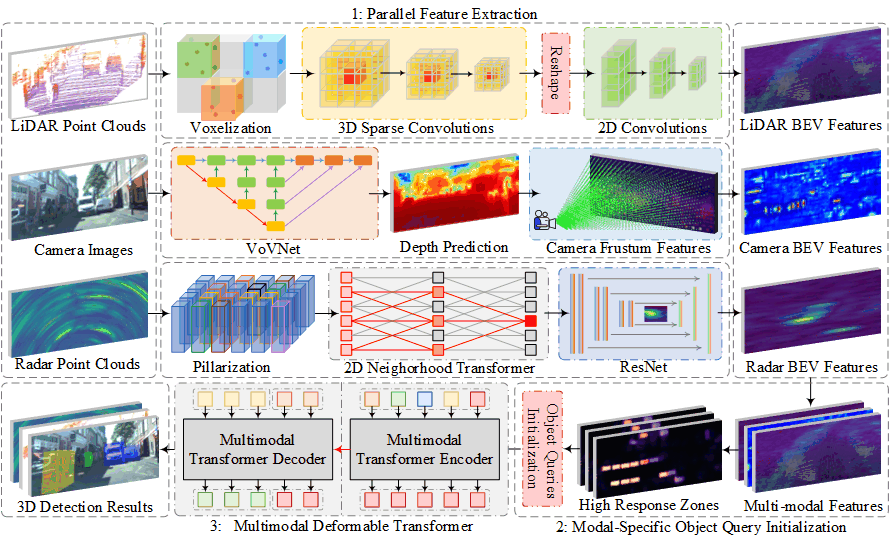
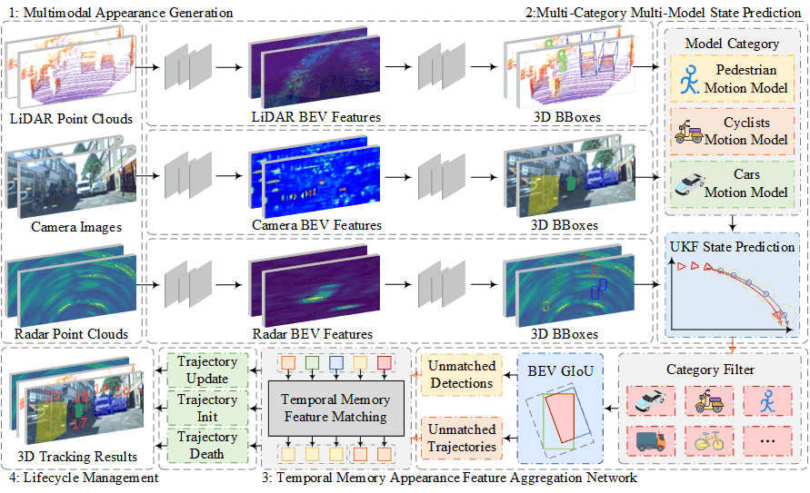

# HybridFusion
The public source code of "HybridFusion: A Universal Multimodal Data Fusion Framework for 3-D Detection and Tracking"
## Abstract
Effective environment perception based on multimodal data fusion is crucial for the development of autonomous driving (AD) technology. However, the existing fusion-based detection and tracking methods often struggle to efficiently utilize the multimodal complementary information. This limitation can significantly impact the safety of autonomous vehicles (AVs), especially in complex traffic scenarios and adverse weather conditions. To address this issue, this work proposes a universal multimodal data fusion framework called HybridFusion for 3-D object detection and tracking tasks. Specifically, a novel Modal-Specific Feature Interaction Strategy (MSFIS) is introduced within the detection algorithm. The strategy complementarily fuses multimodal features while preserving the potential information from individual modalities. It also leverages the multi-channel observation (MCO) capabilities of multi-sensors, thereby ensuring the compatibility and completeness of environmental information. Furthermore, a Motion-Appearance Coupling Driven Data Association Strategy (MACD-DAS) is incorporated into the tracking algorithm. The strategy accurately analyzes the nonlinear kinematic characteristics of traffic participants and significantly improves the overall consistency of multimodal appearance features. Comprehensively processing spatial motion information and multimodal appearance features effectively reduces the uncertainty in state prediction and feature matching. Extensive experiments were conducted on View-of-Delft (VoD) and K-Radar datasets. The experimental results demonstrate that the proposed HybridFusion effectively overcomes the shortcomings of the existing multimodal data fusion methods and significantly improves the accuracy of detection and tracking algorithms in complex traffic scenes and severe weather conditions.
### Fusion Detection

### Tracking

## Concat
Please leave a issue or contact chengzhang with chengzhang971011@gmail.com
